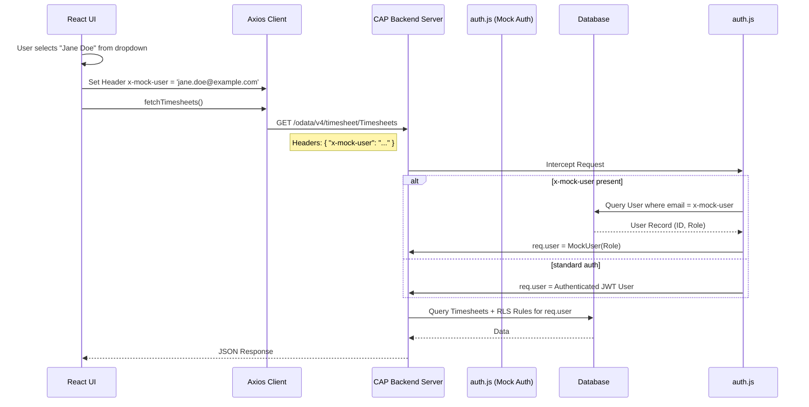
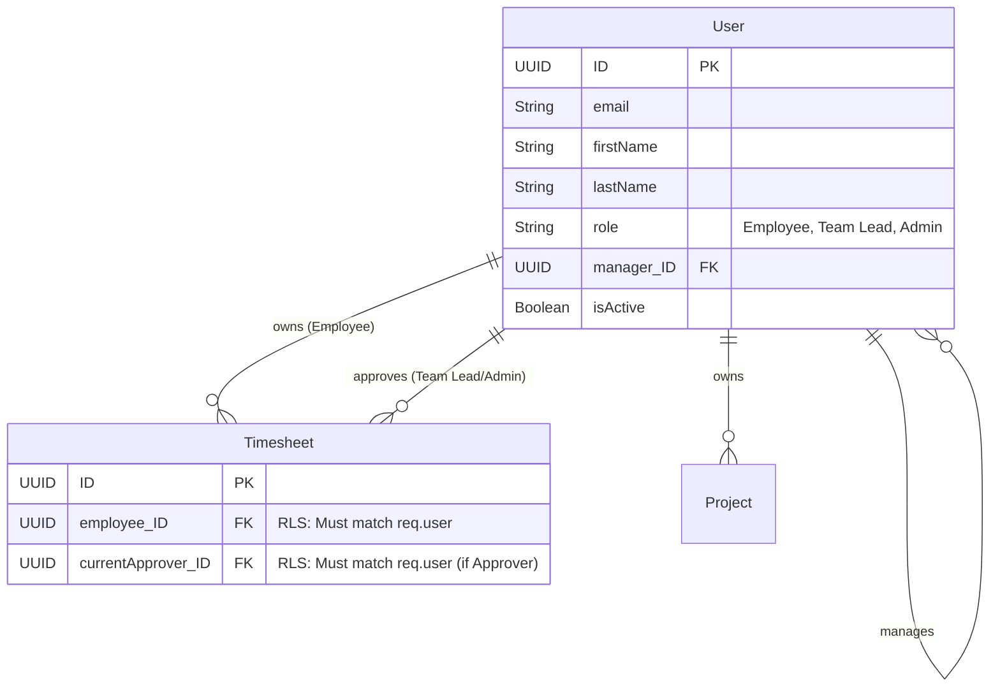

# Admin & Security Feature

## 1. Feature Overview

The Admin feature provides centralized control over the Timesheet application's master data, roles, and security model. It encompasses user management, global oversight of timesheets, and tools for data export. This document also outlines the overarching security and authorization architecture.

## 2. User Guide (How to Use)

### 2.1. Admin Dashboard Capabilities
Users with the **Admin** role have access to an extended navigation menu and dashboard.

1.  **User Management**: Add, remove, or modify users in the system. Assign their system role (`Employee`, `Team Lead`, `Admin`) and define their reporting `Manager`.
2.  **Global Timesheet Oversight**: Unlike Employees or Team Leads who only see their own or assigned timesheets, Admins can view *all* timesheets across the entire organization.
3.  **Final Sign-Off**: Admins serve as the final step in the approval workflow, transitioning timesheets from `Approved` (by Team Leads) to `Finished`.
4.  **Data Export**: Admins can export completed timesheets to Excel for payroll processing.

### 2.2. Development/Testing Tool: `x-mock-user`
For non-production environments, the system implements a user-switching mechanism to facilitate rapid testing of roles and row-level security.

1.  **Sidebar Dropdown**: A dropdown in the application sidebar allows switching the active user.
2.  **Selection**: Choose a user from the dropdown (e.g., switch from an Admin to a standard Employee).
3.  **Result**: The application state resets, and all subsequent API calls are executed as if authenticated by the selected user, applying their specific row-level security filters.

---

## 3. Architecture & Security Components

### Components Involved:
*   **Authentication**: Managed by SAP BTP XSUAA (extended services for UAA) in production.
*   **Authorization**: Defined in `srv/service.cds` using the `@requires` annotation.
    ```cds
    // Example from srv/service.cds
    service AdminService @(requires: 'Admin') {
        entity Users as projection on db.User;
    }
    ```
*   **Row-Level Security (RLS)**: Enforced via `srv/timesheet-service.js` event handlers.
    *   *Rule*: `SELECT` operations on `Timesheet` are intercepted. A `WHERE` clause is dynamically appended: `Employee_ID = currentUser.ID OR currentApprover_ID = currentUser.ID`. Admins bypass this clause.

### Development Authentication Flow (`x-mock-user`)
To support the UI user-switcher, the CAP backend employs custom authentication logic when running locally.



---

## 4. Data Models (ER Diagram)

The foundational `User` entity dictates the security and routing within the application.



### Key Fields Dictating Security:
*   **`role`**: Determines which OData services (`TimesheetService` vs. `AdminService`) the user can access.
*   **`manager_ID`**: A self-referencing relationship. When an Employee submits a timesheet, if no specific approver is chosen, the `manager_ID` dictates the default routing for the approval workflow.
