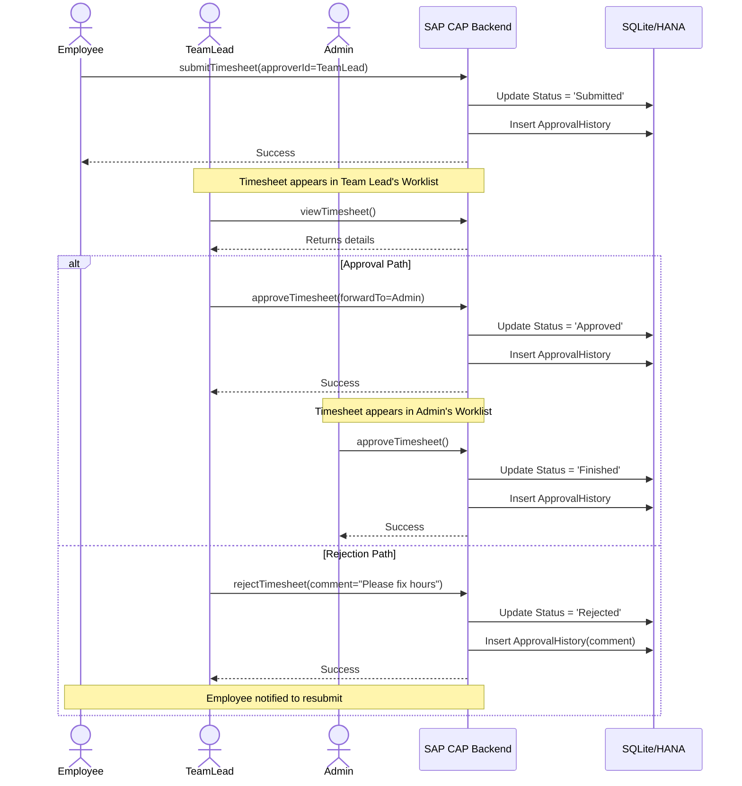
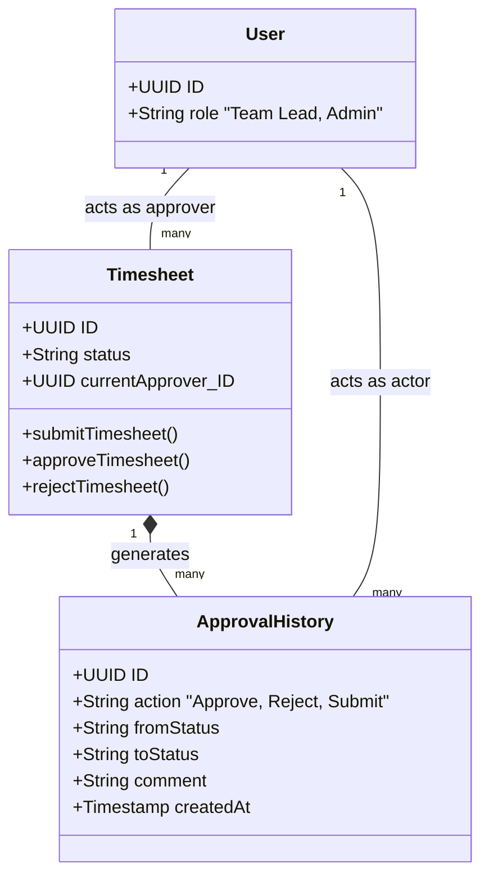

# Approvals Feature

## 1. Feature Overview

The Approvals feature orchestrates the review process for submitted timesheets. It provides specialized interfaces for **Team Leads** and **Admins** to review employee hours, approve them, reject them for corrections, or modify the final billable hours without altering the original employee logs.

## 2. User Guide (How to Use)

### 2.1. Accessing the Approval Worklist
Team Leads and Admins have access to an `Approval Worklist` accessible from their dashboard or navigation menu.

*   **Worklist View**: Displays a table of all timesheets currently waiting for their approval (Status = `Submitted` or `Approved` awaiting final sign-off).
*   **Filtering & Sorting**: Users can filter by employee, project, date range, or specific status.

### 2.2. Reviewing a Timesheet
1.  **Open Timesheet**: Click on a distinct row in the worklist to view the detailed timesheet view.
2.  **Analyze Entries**: Review the individual daily entries, logged hours, and employee notes.
3.  **Check Warnings**: System warnings (e.g., "Over 10 hours logged in a single day") are highlighted to assist the review.

### 2.3. Actions: Approve, Reject, or Modify
Approvers have several actions available in the footer of the timesheet details view:

*   **Approve**:
    *   Click the **Approve** button.
    *   *Team Leads*: The status changes to `Approved`. They can optionally forward it to an Admin by selecting one.
    *   *Admins*: The status changes to `Finished`.
*   **Reject**:
    *   Click the **Reject** button.
    *   A dialog prompts for a mandatory **Rejection Reason/Comment**.
    *   The timesheet status changes to `Rejected`, and it is unlocked for the employee to edit.
*   **Modify Hours**:
    *   If an employee logged 8 hours, but only 6 are billable, the Approver does not change the 8. Instead, they edit the **Approved Hours** field to 6.
    *   This preserves the employee's original log while establishing the correct billable amount.

---

## 3. Architecture & Technical Components

### Components Involved:
*   **Frontend (UI)**:
    *   `ApprovalWorklist`: The main table view for pending approvals.
    *   `TimesheetDetails`: Reused from the Timesheet feature but with alternative footer actions (`Approve`, `Reject`) rendered based on the user's role and the timesheet's state.
    *   State Management: Managed via a dedicated `approvalStore`.
*   **Backend (Service)**:
    *   **Endpoint**: `/odata/v4/admin/` (for Admins) and `/odata/v4/timesheet/` (for Team Leads handling their assigned employees).
    *   **Handlers**: Custom actions `approveTimesheet`, `rejectTimesheet`, `submitToAdmin`.
*   **Database Entities**: `ApprovalHistory` is heavily utilized here to track the audit trail.

---

## 4. Workflows & Data Flow

Below is a Sequence Diagram detailing the end-to-end data flow when a timesheet is submitted, reviewed by a Team Lead, and finalized by an Admin.

### Security & Authorization Enforcement
*   **Team Leads**: Can only view and act upon timesheets where their `User ID` matches the timesheet's `currentApprover_ID`.
*   **Admins**: Can view and act upon any timesheet in the system, bypassing the strict `currentApprover` check if necessary (e.g., if a Team Lead is on vacation).

---

## 5. Audit Trail & Data Integrity

The system relies on the `ApprovalHistory` entity to maintain compliance. Approvers cannot permanently delete timesheets or timesheet entries once they leave the `Draft` state; they can only transition them through the state machine.

