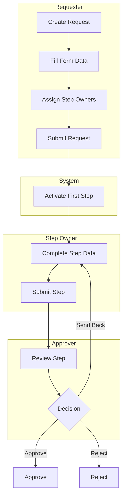

# Main Process Flow

This document outlines the standard request process using a swimlane diagram. We will improve the content later.

```mermaid
flowchart TD
    subgraph Requester [Requester]
        direction TB
        A[Create Request] --> B[Fill Form Data]
        B --> C[Assign Step Owners]
        C --> D[Submit Request]
    end
    
    subgraph System [System]
        direction TB
        E[Activate First Step]
    end
    
    subgraph StepOwner [Step Owner]
        direction TB
        F[Complete Step Data]
        G[Submit Step]
    end
    
    subgraph Approver [Approver]
        direction TB
        H[Review Step]
        I{Decision}
    end

    D --> E
    E --> F
    F --> G
    G --> H
    H --> I
    I -- Approve --> ApproveNode[Approve]
    I -- Reject --> RejectNode[Reject]
    I -- Send Back --> F
```
