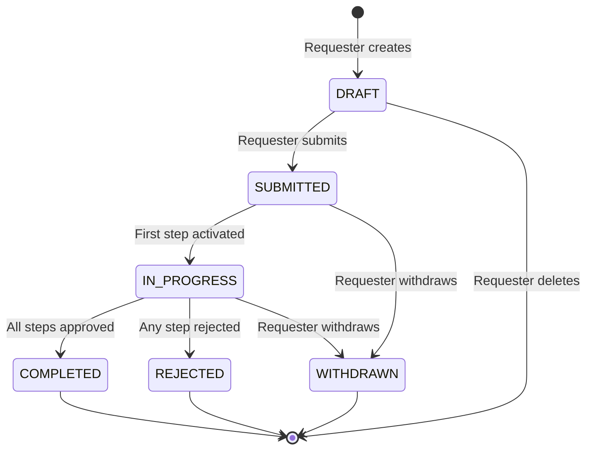

# Secondary Process Flow

This document tracks the possible states of a request. We will improve the content later.

```mermaid
stateDiagram-v2
    [*] --> DRAFT : Requester creates
    
    DRAFT --> SUBMITTED : Requester submits
    DRAFT --> [*] : Requester deletes
    
    SUBMITTED --> IN_PROGRESS : First step activated
    SUBMITTED --> WITHDRAWN : Requester withdraws
    
    IN_PROGRESS --> COMPLETED : All steps approved
    IN_PROGRESS --> REJECTED : Any step rejected
    IN_PROGRESS --> WITHDRAWN : Requester withdraws
    
    COMPLETED --> [*]
    REJECTED --> [*]
    WITHDRAWN --> [*]
```
