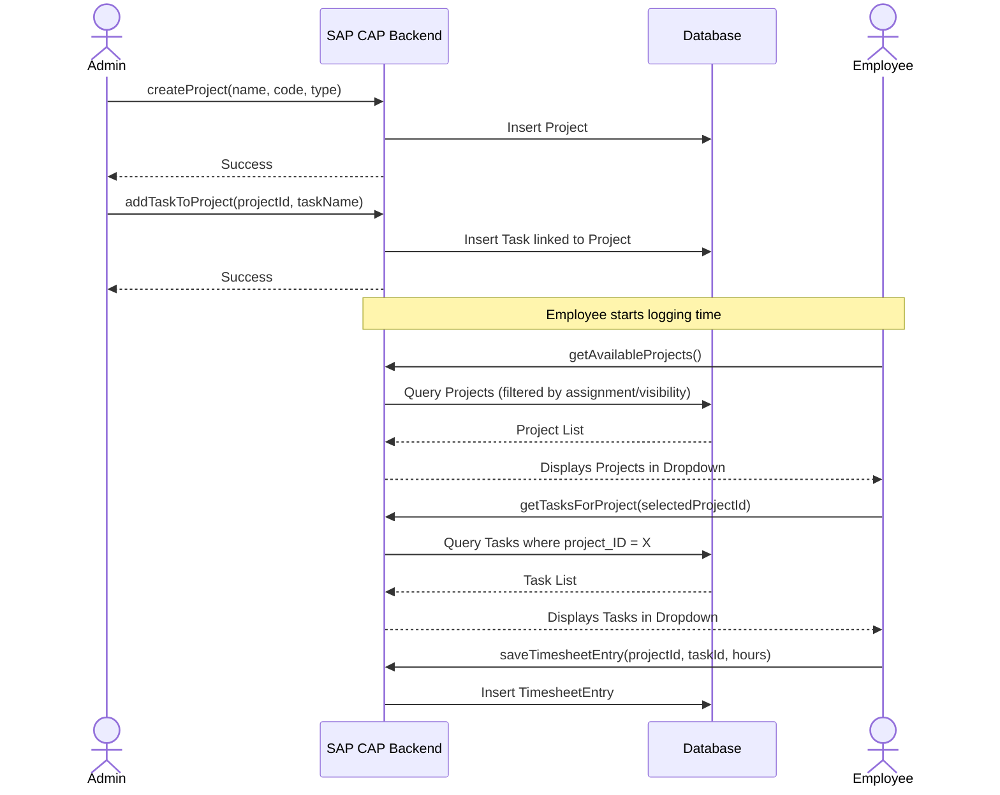
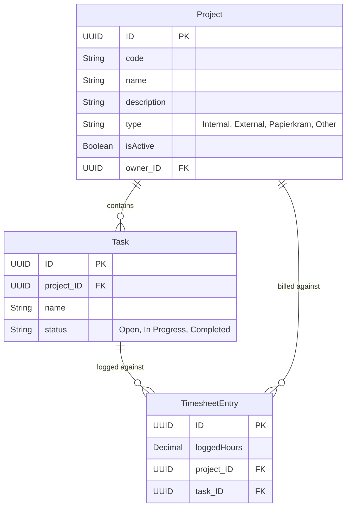

# Projects Feature

## 1. Feature Overview

The Projects feature manages the master data against which employees log their time. A Project serves as the highest-level bucket for time categorization, while Tasks provide a granular breakdown of the specific work performed within a Project.

## 2. User Guide (How to Use)

### 2.1. Managing Projects
Users with **Admin** or **Project Manager** roles can configure the Projects available in the system.

1.  **Access Projects**: Navigate to the **Projects** view from the main dashboard.
2.  **Create Project**: Click **New Project**.
    *   **Project Name**: E.g., "SAP Implementation Phase 1".
    *   **Project Code**: A unique identifier (e.g., `PRJ-SAP-01`).
    *   **Project Type**: Select from `Papierkram`, `Internal`, `External`, or `Other`.
    *   **Owner**: Typically defaults to the creator, but can be reassigned.
3.  **Edit Project**: Click on an existing project to update its active status or metadata.

### 2.2. Managing Tasks within a Project
Tasks provide the necessary granularity for accurate timesheet logging.

1.  **View Project Details**: Open a specific project.
2.  **Add Task**: Navigate to the **Tasks** tab or section within the Project details.
3.  **Define Task**:
    *   **Task Name**: E.g., "Requirement Gathering", "Development", "UAT Testing".
    *   **Status**: E.g., `Open`, `In Progress`, `Completed`.
4.  **Enforcement**: Employees *must* select a Task when logging time against this project.

### 2.3. Project Visibility
When users go to the **Timesheet** view to log time, the dropdown list of available Projects is filtered. They will only see Projects they are explicitly assigned to (or all if the particular implementation enforces open visibility).

---

## 3. Architecture & Technical Components

### Components Involved:
*   **Frontend (UI)**:
    *   `ProjectList`: View displaying all projects.
    *   `ProjectDetails`: View displaying project metadata and associated tasks.
    *   State Management: Managed via a dedicated `projectStore` (Zustand).
*   **Backend (Service)**:
    *   **Endpoint**: `/odata/v4/admin/Project` and `/odata/v4/admin/Task`.
    *   **Handlers**: Logic in `srv/admin-service.js`.
*   **Database**: SQLite/HANA storing `Project` and `Task` entities.

---

## 4. Workflows & Data Flow

The flow of creating and utilizing Projects and Tasks is straightforward but critical for the Timesheet feature.

---

## 5. Data Models (ER Diagram)

The following Entity Relationship Diagram (ERD) illustrates the structure of Projects and Tasks and how they connect back to Timesheet Entries.

### Key Relationships
*   **Hierarchical**: A `Project` is the parent entity. A `Project` can have many `Tasks` (1-to-N).
*   **Referential Integrity**: A `TimesheetEntry` *must* reference a valid `Project` and should reference a valid `Task` belonging to that specific `Project`. The UI enforces this by loading Tasks dynamically based on the selected Project.
