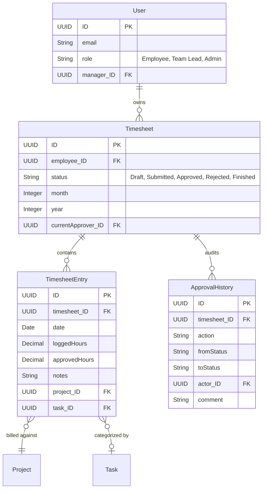

# Timesheet Feature

## 1. Feature Overview

The core purpose of the Timesheet Management application is to enable employees to track their working hours accurately against specific projects and tasks. This feature provides a user-friendly interface to log daily entries, manage draft timesheets for current and past months, and submit them for managerial approval.

## 2. User Guide (How to Use)

### 2.1. Accessing and Viewing Timesheets
When users log into the application with the **Employee** role, they are presented with their Timesheet overview.

*   **Navigation**: Go to the **Timesheet List** view to see all historical and current timesheets.
*   **Filtering**: Users can filter timesheets by their status (`Draft`, `Submitted`, `Approved`, `Rejected`, `Finished`).

### 2.2. Logging Time (Draft Mode)
Employees typically track time continually as they work on a day-to-day basis. Timesheets for the current month are usually in a `Draft` status.

1.  **Open an Active Timesheet**: Click on the current month's timesheet (labeled **Draft**).
2.  **Select a Day**: Click on a distinct day in the main calendar view. (Weekends are styled distinctly).
3.  **Add Entry**:
    *   Click **Add Entry** to create a new time log for that specific day.
    *   **Project**: Select the project you're billing against. (You only see projects you're assigned to).
    *   **Task**: Select the specific task within that project.
    *   **Hours**: Input the duration of work (e.g., `4.5` hours).
    *   **Notes (Optional)**: Provide a description of what was accomplished.
4.  **Bulk Actions**: If you have multiple entries, you can select them using checkboxes and use actions like **Duplicate Day** or **Delete Selected** to speed up data entry for repetitive tasks.

> [!TIP]
> Changes made to a Draft timesheet are saved automatically in real-time. You do not need to manually click a "Save" button for the overall timesheet.

### 2.3. Submitting for Approval
At the end of the billing period (typically month-end), the employee submits their timesheet.

1.  **Initiate Submission**: From the timesheet detail view, click the **Submit** button in the footer.
2.  **Select Approver**: A dialog appears prompting you to select an Approver (a Team Lead, Manager, or Admin).
3.  **Confirm**: After submission, the timesheet is locked for editing, and its status changes to `Submitted`.

### 2.4. Handling Rejections
If an approver finds an issue, they may reject the timesheet back to the employee.

1.  **Review Rejection**: Locate the `Rejected` timesheet in the list.
2.  **Read Comments**: Open the timesheet to view the rejection comment provided by the approver.
3.  **Edit & Resubmit**: The timesheet is unlocked. Make the necessary corrections to hours or entries and click **Submit** again.

---

## 3. Architecture & Technical Components

The application follows a standard Client-Server architecture built on the modern SAP Cloud Application Programming Model (CAP) and React.

### Components Involved:
*   **Frontend (UI)**: React/Vite using TypeScript and Tailwind CSS.
    *   `TimesheetPage`: The main container for viewing a timesheet.
    *   `DailyEntryList`: Component for manipulating individual entries.
    *   `TimesheetFooter` / `CalendarHeader`: Shared contextual UI.
    *   State Management: Managed via a dedicated `timesheetStore` (Zustand).
*   **Backend (Service)**: Node.js (CAP).
    *   **Endpoint**: `/odata/v4/timesheet/`
    *   **Handlers**: Logic in `srv/timesheet-service.js` (validations, state transitions).
*   **Database**: SQLite (local) / HANA (production deployment).

### Security & Row-Level Security
*   **Authentication**: Standard SAP BTP Authentication.
*   **Visibility**: Handled via custom logic restricting users to viewing only their own timesheets unless they possess an elevated role (`Admin`) or are the `currentApprover`.

---

## 4. Workflows & Data Flow

The lifecycle of a timesheet follows a strict state machine to guarantee that recorded time cannot be arbitrarily mutated once submitted or approved.

```mermaid
stateDiagram-v2
    direction LR

    [*] --> Draft : Created
    
    state "Draft" as Draft {
        [*] --> Editing
        Editing --> [*]
        note right of Editing: Employee adds/edits/deletes entries
    }

    Draft --> Submitted: User Submits
    
    state "Submitted" as Submitted {
        note right of Submitted: Locked for Employee.\nWaiting for Approver.
    }

    Submitted --> Approved: Team Lead Approves
    Submitted --> Rejected: Approver Rejects
    
    Approved --> Submitted: Team Lead Forwards to Admin
    Approved --> Finished: Final Admin/Manager Sign-Off
    
    Rejected --> Submitted: User Resubmits

    state "Finished" as Finished {
        [*] --> Archived
    }
```

### Detailed Flow Steps
1.  **Draft**: `Timesheet` entity is created. User can freely modify linked `TimesheetEntry` records. Only `loggedHours` are tracked.
2.  **Submitted**: User invokes the `submitTimesheet` action. Status changes. The record is locked. `currentApprover` field is populated, and an `ApprovalHistory` audit record is created.
3.  **Approval / Rejection**: Handled via `approveTimesheet` or `rejectTimesheet` actions (detailed in Approvals Documentation).
4.  **Finished**: Final state representing a locked, fully processed timesheet ready for external payroll/billing integrations.

---

## 5. Data Models (ER Diagram)

Below is the entity relationship diagram focusing on how Timesheets associate with Users and Projects.



*   **Logged vs. Approved Hours**: `TimesheetEntry` contains `loggedHours` (input by the employee) and `approvedHours` (can be modified by approvers without destroying the original employee record).
*   **Audit Trail**: The `ApprovalHistory` entity ensures full traceability of who changed the state of the timesheet and when.
